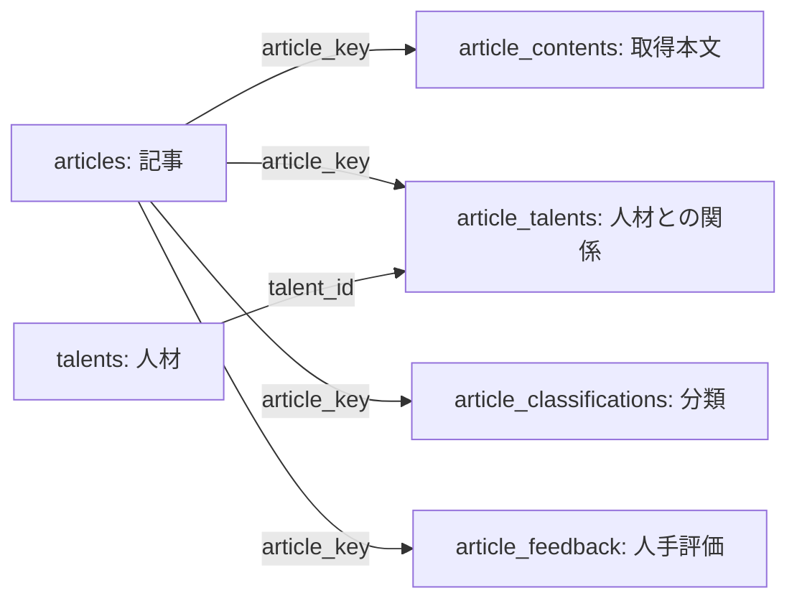

# DB集約に向けた現状調査資料

調査日: 2026-09-14 JST。用途: 「DBへの集約」の作業指示書を作るための現状把握。

本資料は現行DB・コード・保存ファイルを調べたもの。DB移行や「AIへ渡す情報の最小化」の実装は行っていない。両作業は別工程とし、ここでは現状と集約設計で決める必要がある事項までを扱う。

## 1. 現状の要点

- 業務データはn8nのSQLite内にある6個のData Tableと、リポジトリ内のJSON・JSONL・Markdownに分散している。
- 記事本文はすでに`article_contents`にも保存される。ただし、ファイル版にある完全性・メタデータ・再試行予定などがDB版には揃っていない。
- AI入力は主に日次ファイルを読み、共通レビューもファイルに保存する。DBを記事データ全体の唯一の正本とする構成ではない。
- 記事・人材・分類等の業務キーはプログラムが検証してupsertする。実DBでは業務列にUNIQUE制約・外部キー・追加インデックスがない。
- 集約時には、識別子の不一致・重複・日次履歴・本文版・確認記録の根拠を保持する必要がある。

## 2. DBの配置と管理単位

| 項目 | 現在の構成 |
| --- | --- |
| DBファイル | `/home/raimu/.n8n/database.sqlite`（今回確認した配置） |
| 接続先の解決 | 確認アプリは`N8N_DATABASE_PATH`を優先。未指定時は`N8N_USER_FOLDER`配下、既定`~/.n8n/database.sqlite` |
| DB製品 | SQLite。調査用クライアントのSQLiteライブラリは3.31.1。n8n側のライブラリ版を表す値ではない |
| ジャーナル | WAL |
| 業務テーブル管理 | n8n Data Tables。`data_table`が名前とIDを管理し、実体は`data_table_user_<ID>` |
| 通常の書き込み | n8nの反映ワークフロー、またはData Tables API |
| 確認画面の読み込み | SQLiteを読み取り専用で参照し、ファイル情報で補完 |

同じSQLite内にはn8n自身のワークフロー・実行履歴・認証情報等も存在する。これらは記事管理テーブルとは別のシステム領域。今回、認証情報の内容は取得していない。DB集約の移行対象にn8n内部全体を自動的に含めない。

`workflow_entity.staticData`内の`global.autoKeywords`は、日次ワークフローの自動キーワードの保存先として利用されている。手動設定は別途`config/keywords.json`にある。

## 3. 実DBのテーブル一覧

以下は11:02 JST頃の調査値。運用中のDBなので将来変わる。画面はフィルター・提案ファイル補完等があるため、画面件数と物理行数は同じ指標ではない。

| 論理テーブル | 役割 | 実行時の照合・更新キー | 物理行数 |
| --- | --- | --- | ---: |
| `articles` | 記事の基本情報 | `article_key` | 18,009 |
| `article_contents` | 取得本文と取得結果の一部 | `article_key` | 14,822 |
| `talents` | 人物・団体候補の登録台帳 | `talent_id` | 604 |
| `article_talents` | 記事と人材の紐付け・根拠 | `relation_key` | 1,675 |
| `article_classifications` | レビュー済み分類 | `article_key` | 830 |
| `article_feedback` | 人手の可否評価 | `article_key` | 16 |

### 共通列と制約

全6テーブルに`id INTEGER PRIMARY KEY`、`createdAt datetime(3) NOT NULL`、`updatedAt datetime(3) NOT NULL`がある。作成・更新日時には現在時刻の既定値があるが、既定値だけで更新時刻が自動更新されるとは限らず、更新処理にも依存する。

業務列は実DB上すべてNULL許容。業務キーにもDBの一意制約はない。`PRAGMA index_list`と`PRAGMA foreign_key_list`は全6テーブルで空だった。SQLiteの整数主キー自体は別であり、「主キーもない」という意味ではない。JSON配列は専用の子テーブルではなくTEXT内に保存する。

### テーブル間の論理的な関係

矢印はプログラム上の参照関係。DBが強制する外部キーではない。分類・評価・本文はキー単位でupsertする設計だが、履歴版を保持する独立したテーブルはない。

## 4. 列定義

物理型は実DBの`PRAGMA table_info`による。n8nのstring/date/number等の表記と異なる場合がある。共通列は前節を参照。

### articles

物理テーブル: `data_table_user_SxxxaIzNRCuyag42`。このIDは現在のn8n環境固有。

| 列 | SQLite上の型 | 内容 |
| --- | --- | --- |
| `article_key` | `text` | 記事の業務キー。SQLiteのidとは別。 |
| `url` | `text` | 収集元のURL。 |
| `title` | `text` | 記事タイトル。 |
| `excerpt` | `text` | RSS等の抜粋。本文ではない。 |
| `source` | `text` | 情報源の表示名。 |
| `published_at` | `datetime(3)` | 記事の公開日時。 |
| `last_seen_at` | `datetime(3)` | 最後に提案等で確認・更新した日時。日次収集履歴の代替ではない。 |

### article_contents

物理テーブル: `data_table_user_zcsbkDjtHx8ixldU`。このIDは現在のn8n環境固有。

| 列 | SQLite上の型 | 内容 |
| --- | --- | --- |
| `article_key` | `text` | 記事の業務キー。SQLiteのidとは別。 |
| `original_url` | `text` | 本文取得前の元URL。 |
| `resolved_url` | `text` | リダイレクト等を解決したURL。 |
| `source_domain` | `text` | 情報源のドメイン。 |
| `content_type` | `text` | 記事・動画等の種類。 |
| `content_status` | `text` | 取得状態。意味的なレビュー完了とは別。 |
| `content_text` | `text` | 取得した本文テキスト。 |
| `content_length` | `real` | 本文文字数。物理型はreal。 |
| `content_hash` | `text` | 本文テキストのハッシュ。共通レビューのinputHashとは別。 |
| `extraction_method` | `text` | 抽出方法。 |
| `failure_reason` | `text` | 取得失敗・不足の理由。 |
| `content_path` | `text` | 本文アーカイブファイルへの参照。 |
| `fetched_at` | `datetime(3)` | 取得試行日時。 |

### talents

物理テーブル: `data_table_user_OF29JuraLMGFrnxt`。このIDは現在のn8n環境固有。

| 列 | SQLite上の型 | 内容 |
| --- | --- | --- |
| `talent_id` | `text` | 人材の業務キー。 |
| `display_name` | `text` | 表示名。 |
| `organization` | `text` | 所属名。 |
| `aliases_json` | `text` | 別名の配列をJSON文字列として保存。 |
| `status` | `text` | pending / approved / rejected。 |
| `search_enabled` | `boolean` | 検索語として有効か。approvedとの両条件で日次検索に使用。 |
| `auto_discovered` | `boolean` | 自動検出由来のフラグ。 |
| `last_seen_at` | `datetime(3)` | 最後に提案等で確認・更新した日時。日次収集履歴の代替ではない。 |

### article_talents

物理テーブル: `data_table_user_yRjO5ajn72B5hvxA`。このIDは現在のn8n環境固有。

| 列 | SQLite上の型 | 内容 |
| --- | --- | --- |
| `relation_key` | `text` | 紐付けレコードの業務キー。 |
| `article_key` | `text` | 記事の業務キー。SQLiteのidとは別。 |
| `talent_id` | `text` | 人材の業務キー。 |
| `matched_aliases_json` | `text` | 一致した表記の配列をJSON文字列として保存。 |
| `matched_fields` | `text` | 根拠が見つかった箇所の表記。 |
| `evidence_text` | `text` | 判断・紐付けの文章根拠。 |
| `confidence` | `real` | 確信度。プログラム側で0〜1を検証。 |
| `detection_method` | `text` | 紐付け方法。 |
| `last_seen_at` | `datetime(3)` | 最後に提案等で確認・更新した日時。日次収集履歴の代替ではない。 |

### article_classifications

物理テーブル: `data_table_user_D8O0LdG5wjlFd615`。このIDは現在のn8n環境固有。

| 列 | SQLite上の型 | 内容 |
| --- | --- | --- |
| `article_key` | `text` | 記事の業務キー。SQLiteのidとは別。 |
| `article_type` | `text` | 記事種別ID。 |
| `primary_category` | `text` | 主カテゴリID。 |
| `secondary_categories_json` | `text` | 副カテゴリIDのJSON配列文字列。 |
| `relevance` | `text` | in_scope / low_relevance / out_of_scope。 |
| `confidence` | `real` | 確信度。プログラム側で0〜1を検証。 |
| `evidence_text` | `text` | 判断・紐付けの文章根拠。 |
| `classification_method` | `text` | 分類方法。 |
| `classified_at` | `datetime(3)` | 分類判断日時。 |

### article_feedback

物理テーブル: `data_table_user_tpNuI6usWl5x1wnR`。このIDは現在のn8n環境固有。

| 列 | SQLite上の型 | 内容 |
| --- | --- | --- |
| `article_key` | `text` | 記事の業務キー。SQLiteのidとは別。 |
| `article_url` | `text` | 評価対象の記事URL。 |
| `is_rejected` | `boolean` | 不可評価のフラグ。行がない未評価とは区別。 |
| `reason_code` | `text` | 不可理由のコード。 |
| `source_domain` | `text` | 情報源のドメイン。 |
| `publisher_label` | `text` | 媒体表示名。 |
| `title_signature` | `text` | タイトルの照合用表記。 |
| `reviewed_at` | `datetime(3)` | 人手評価日時。 |
| `review_source` | `text` | 評価の由来。 |

## 5. DBとファイルの役割分担

| データ | 現在の主な保存先 | 読み書き・役割 | DB集約で保持が必要な意味 |
| --- | --- | --- | --- |
| 日次収集結果 | `content/structured-records/YYYY-MM-DD.jsonl` | 日次ワークフローがrun行とarticle行を保存。AI入力リーダーが参照 | 対象日、実行条件、検索語一致、日次の観測履歴。articlesの最新行だけでは再現できない |
| 記事台帳・人材・関係 | Data Tables + `content/talent-index-proposals/` | 提案保存後に反映ワークフローでDB更新 | 提案と反映済み状態、既存承認状態の区別 |
| 取得本文 | `article_contents` + `content/article-body-captures/YYYY-MM-DD.jsonl` | 本文取得スクリプトが双方へ保存。AIは日次JSONLを参照 | 本文、元URL・解決URL、取得状態、取得日時、抽出範囲、版 |
| 取得キャッシュ | `content/article-body-captures/backfill-state.json` | URL別entriesとresolvedUrls。本文や取得状態も重複保持 | 再利用条件、本文と取得試行の関係 |
| アクセス間隔・再試行 | `rate-limit-state.json`、キャッシュのretry_after、任意の進捗ファイル | ホスト別待機・間隔、処理済みURLを保存 | 429の待機期限、再開の可否、未完了 |
| AI共通確認記録 | `content/article-review-facts/YYYY-MM-DD.jsonl` | 専用保存処理が検証・マージ。3工程で共有 | 事実、人物、引用位置、入力・ルールのハッシュ、工程別ready/held/needs_review |
| 確認済み要約 | `content/article-summaries/YYYY-MM-DD.md` | 確認画面はURL付き本文確認済み項目を解析 | 確認済み状態、対応URL、保存日、要約本文。自動下書きとの区別 |
| 分類提案 | `content/article-classification-proposals/` + DB | 反映済みはDB。画面・週次は提案も利用 | 提案日時・根拠・入力との対応。DBにはinputHash列がない |
| 人手評価 | `article_feedback` + `content/article-feedback-instructions/` | 評価をDBへ反映し、全件JSONを集計用に出力 | 未評価と可・不可の違い、評価参照日、完全なスナップショット |
| 週間集計・考察 | `content/analysis/`、`content/weekly-reports/` | 日次ファイル・レビュー・分類・採否を集計 | 収集締切と評価参照日、根拠台帳、生成版 |
| 人材公式情報 | `content/official-talent-registry/` | 公式情報同期・表示補完 | 出典と更新日。talentsだけに全情報はない |
| 指示書・候補語 | `content/ai-*-instructions/`等 | 日次生成、候補は提案として保存 | 実行時に使った指示書版、提案と採用の区別 |
| 運用証跡 | `.operation-state/`、`.operation-logs/` | checkpoint、反映状態、診断、表示確認 | 完了・未実行・送信不明・失効を混同しない |
| トークン計測 | `content/operation-usage/`、`.operation-state/token-usage/` | 比較アプリは集計JSONを読む。生ログは外部のCodexログ | 計測区間、未割当、暫定集計。記事DBとは別途移行範囲を決める |

本文ファイル側には`contentMarkdown`、`contentCompleteness`、`pageMetadata`、`nonContentText`、`extractionScope`、自動抽出の`summary`があるが、`article_contents`には対応列がない。`retry_after`はキャッシュにあり、DBの本文列にはない。既存DBだけを使ってファイルを削除すると情報が失われる。

## 6. 現在の読み書きの流れ

1. **収集**: Daily Keyword News Summaryが検索・RSS結果を日次ファイルと指示書に保存。検索対象人材はDBのapprovedかつsearch_enabledを参照する。日次収集だけで人材提案のDB反映はしない。
2. **本文取得**: `capture_article_contents.py`が日次記事・取得キャッシュを読み、本文ファイルとキャッシュを更新。通常はData Tables APIで`article_contents`へ同期する。同期無効・接続失敗時はファイルだけ進み得る。
3. **AI確認**: `read_ai_inputs.py`が日次構造化記事・本文JSONL・共通確認JSONLを結合する。`article_contents`をAI入力の正本として読む経路ではない。
4. **共通記録の保存**: `save_article_review_facts.py`が入力ハッシュ・引用・参照関係等を検証してファイルへマージする。要約・人材・分類のreadyは個別に保持する。
5. **提案と反映**: 人材反映ワークフローがarticles→talents→article_talentsをupsert。分類は登録済み記事URLからarticle_keyを解決してupsert。人手評価は別ワークフロー。
6. **画面**: 記事・人材・関係・分類・評価はDBから取得。要約・公式情報・週次はファイルから補完。分類は提案ファイルを先に読み、その後DB行を優先する。DB読み取り不可時は記事・人材等も提案ファイルへフォールバックする。
7. **週次**: `weekly_metrics.py`が日次記事・取得本文・共通記録・分類提案・採否スナップショットを読み、指標・台帳をファイルへ保存する。

このため、画面上部の「n8n Data Tables」は画面の全項目がDBだけにあることを保証しない。

## 7. 識別子と履歴の注意点

- `articles.article_key`は業務識別子、`id`はn8nの行ID。同一視しない。
- `generate_daily_review_outputs.py`の現行生成は`article-` + URLのSHA-256先頭16桁。本文取得は既存キーが得られなければURLのSHA-256全64桁を使う。全経路が同じ方式ではない。
- `article_talents`の生成例はarticle_keyとtalent_idを連結した値からrelation_keyを作る。関係の意味上の同一性は「記事・人材ペア」も確認する必要がある。
- 共通レビューの一致条件はURL・`inputHash`・`policyHash`。inputHashは本文だけでなくタイトル・抜粋・公開日・取得情報等を含む。非verifiedでは取得試行日時も含む。
- `content_hash`は本文テキストのハッシュであり、共通レビューのinputHashを代替できない。
- 本文根拠の記録は条件一致時に過去日から再利用できる。部分取得・メタデータ・本文なしの記録は同日限定。移行時に根拠や状態を自動的にreadyへ変更しない。
- `articles`の更新日時やlast_seen_atだけでは「どの収集日に、どの条件で見つかったか」を保存できない。現在は日次ファイルがその履歴を担う。

## 8. 実データの整合性調査

値の内容を公開せず、キー・URLの完全一致による件数を調べた。URLの正規化・同一記事の意味判定は行っていない。

| 確認項目 | 結果 | 集約時の意味 |
| --- | ---: | --- |
| articlesのarticle_key重複 | 0組 | 現時点の一意性。DB制約による保証ではない |
| articlesのURL重複 | 114組、余剰139行 | 同じURLで異なる記事キーがある。1組1行にした場合の余剰であり、削除可能件数ではない |
| article_talentsのrelation_key重複 | 0組 | キーだけでは意味上の重複を見落とす |
| 同じarticle_key・talent_idの関係重複 | 27組、余剰27行 | 根拠・更新時点を比較して統合方針を決める |
| article_contentsのarticle_key重複 | 0組 | URLの一意性とは別 |
| article_contentsのoriginal_url重複 | 37組、余剰37行 | 本文取得結果・版の保持方針が必要 |
| 本文のarticle_keyがarticlesに存在しない | 13,624行 | すべてoriginal_urlでは対応するarticlesが存在。記事欠落と断定せずキー変換を調べる |
| 関係・分類・評価のarticle_key参照不一致 | 各0行 | 調査時点の一致 |
| 関係のtalent_id参照不一致 | 0行 | 調査時点の一致 |
| talentsのtalent_id、分類・評価のarticle_key重複 | 各0組 | 調査時点の一意性 |
| article_keyがNULL・空文字 | 対象5テーブルで各0行 | DB自体はNULLを許容する |

本文のキー不一致は生成経路の違いと整合するが、13,624行すべての生成経緯までは確認していない。移行で元URLを使う場合も記事側URLが重複するため、単純なJOINで一意に決められるとは限らない。

### 保存されている状態の内訳

| article_contents.content_status | 行数 |
| --- | ---: |
| `metadata_only` | 17 |
| `partial` | 277 |
| `unavailable` | 13,884 |
| `unverified` | 3 |
| `verified` | 641 |

`verified`641行は取得器の判定であり、AI要約・意味的レビューが641件完了しているという意味ではない。人材はapproved389行・pending215行。これらを集約時に変更しない。

## 9. DB集約の作業指示書で決める事項

以下は現状から生じる検討事項であり、採用済みの設計ではない。「AIへ渡す情報の最小化」は別作業として扱う。

1. **正本と管理先**: 既存n8n Data Tablesを拡張するか、記事管理用DBを分けるか。n8n管理の実テーブルを直接変更する場合の互換性も検討する。
2. **集約対象**: 記事台帳・収集実行と観測履歴・本文と取得試行・共通レビュー・要約・分類・評価を区別する。候補語、週次、運用証跡、トークン記録まで含めるかを明示する。
3. **ID対応表と重複処理**: 元のarticle_keyを失わず、URL重複・本文キー不一致・関係重複を照合する。削除・統合対象を自動的に推定しない。
4. **版と根拠**: どの本文・タイトルの版をどのルールで確認したかを再現できるようにする。引用の文字位置とハッシュを維持する。
5. **再試行状態**: HTTP429の待機、ホスト間隔、次回予定、取得成功とレビュー完了の区別を保つ。
6. **読み書き経路の切替**: 収集・本文取得・入力リーダー・保存処理・反映・画面・週次を列挙し、ファイルとDBの二重正本を残さない。
7. **互換出力**: Markdown等を閲覧・交換用の出力として残す場合、DBから再生成するものと、編集入力として受け付けるものを区別する。
8. **移行検証と戻し方**: 件数だけでなく、本文・根拠・状態・関連付け・日次履歴を比較する。DBとファイルの整合したバックアップ、復元、切替失敗時の戻し方を定める。

DBへの保存先変更だけではトークン削減率は確定しない。本作業の受入基準は情報と挙動を失わず保存・参照を集約できることとし、AIへの入力項目・会話の分け方・トークン比較は次の作業で設計する。

## 10. 調査根拠と範囲

- [機械可読のスキーマ・件数・整合性調査](database-current-state-2026-09-14.json): 本資料の数値の根拠。記事本文・人材名・認証値は含めない。
- [人材・記事DBの運用](talent-article-index.md)、[分類DBの運用](article-classifications.md)、[確認画面](talent-dashboard.md)
- [AI入力リーダー](../scripts/read_ai_inputs.py)、[共通レビューの一致判定](../scripts/article_review_facts.py)、[保存処理](../scripts/save_article_review_facts.py)
- [本文取得とDB同期](../scripts/capture_article_contents.py)、[既存キー生成](../scripts/generate_daily_review_outputs.py)
- [画面のDB・ファイル読み込み](../apps/talent-dashboard/server.py)、[週次集計](../scripts/weekly_metrics.py)
- [記事・人材反映](../n8n/workflows/apply-talent-index-proposal.workflow.json)、[分類反映](../n8n/workflows/apply-article-classification-proposal.workflow.json)、[評価反映](../n8n/workflows/apply-article-feedback.workflow.json)

調査方法: SQLiteを`mode=ro`で接続し、Data Table一覧、PRAGMAによる列・索引・外部キー、COUNT/GROUP BY/参照照合を実施。実DBとコードを優先し、ドキュメント上の意図と実DB制約を区別した。監査の参照照合は読み取りトランザクション内で行った。スキーマ取得と監査は別時点なので、稼働中の更新があれば差が生じ得る。

実DBへのINSERT/UPDATE/DELETEやスキーマ変更、記事の再取得・再評価は行っていない。全過去ファイルと全DB行の内容一致、n8n内部テーブル全体の調査、移行先方式の決定は今回の対象外。ファイル容量はJSONに補足記録しており、混在する状態ファイルも含むため「記事数」には換算しない。
